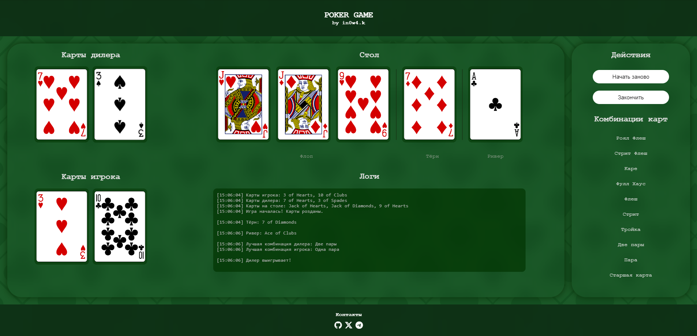

# Poker Game 🎲♠️

Добро пожаловать в **Poker Game** — простой и увлекательный способ почувствовать себя профессиональным игроком в покер прямо в браузере! 


## 🃏 Основные возможности

- 🎴 **Перемешивание и раздача карт:** Автоматическое создание и перемешивание полной колоды из 52 карт.
- 🪄 **Анализ комбинаций:** Игра умеет распознавать классические покерные комбинации, от "Старшей карты" до "Роял-Флэша".
- 📜 **Логирование:** Все игровые действия записываются в удобный журнал.
- 🏆 **Определение победителя:** Сравнение рук игрока и дилера для выявления победителя, включая анализ старшинства карт в случае ничьи.


## 🎮 Как играть

1. **Запуск игры:** 
   - Нажмите кнопку **"Начать игру"** — вам и дилеру будут розданы карты, а на столе появятся первые три карты (флоп).
2. **Игровой процесс:**
   - Последовательно открывайте карты тёрна и ривера, нажимая на кнопку.
3. **Итог:** 
   - После ривера игра автоматически определит победителя и покажет комбинации.
4. **Перезапуск:** 
   - Хотите сыграть ещё раз? Просто нажмите **"Начать заново"**.


## 💻 Технологии

Проект реализован с использованием следующих технологий:  

- **HTML, CSS, JavaScript**: Основа игры и её логики.  
- **DOM API**: Управление отображением карт и логов.  


## 📂 Структура проекта

```
├── index.html       # Главная страница игры
├── style.css        # Стили для интерфейса
├── script.js        # Логика игры
├── combinations.js  # Распознавание комбинаций и определение победителя
└── images/          # Графика карт
```


## 🚀 Запуск

1. Перейдите на сайт: [in0w4k.github.io/Endterm/](https://in0w4k.github.io/Endterm/).  


## 🎨 Интерфейс игры




## 🔧 Возможности для улучшения

- 💡 Реализация многопользовательского режима.
- 💰 Добавление системы ставок и банка.
- 🤖 Улучшение логики дилера для более интересных игровых сценариев.
- 🎭 Поддержка различных режимов покера (например, техасского холдема).


## 💬 Обратная связь

Если у вас есть идеи, вопросы или пожелания, напишите в разделе Issues или свяжитесь со мной [GitHub](https://github.com/in0w4k).

---

✨ Спасибо за внимание! 👑
